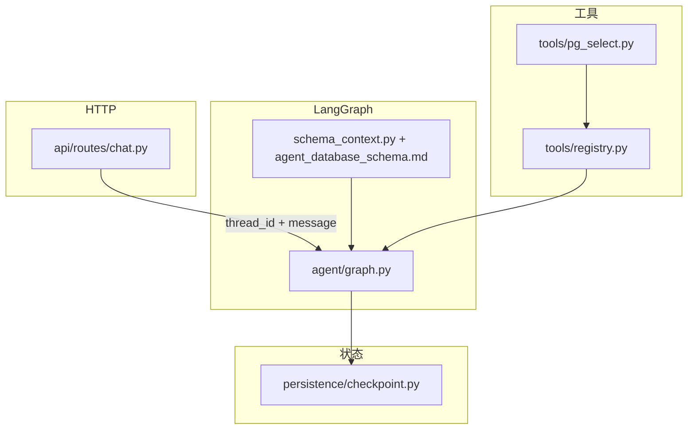

# ChainCloud AI Agent Service

基于 **FastAPI**、**LangGraph** 与 **可插拔 checkpoint**（内存或 PostgreSQL）的智能体 HTTP 服务骨架，目录按「API → graph → tools + checkpoint」划分，便于后续扩展摘要、thread 元数据等能力。

## 设计理念与整体架构

**LangGraph + LangChain**：工具循环、图状态（`messages` 等）与 **checkpoint** 是一套成熟组合——模型节点与工具节点用条件边串联，同一 `thread_id` 下状态可持久恢复。

**Checkpoint**：支持 **PostgreSQL**（`AsyncPostgresSaver`）或进程内内存。会话需要 **跨重启持久**、以后要 **部署/水平扩展** 时，应用 **PG checkpoint**；与业务库 **分连接、分权限** 运维很常见（会话状态与业务数据可同实例不同库/不同账号）。

**工具**：**自写在仓库内**（`tools/`），通过 LangChain `StructuredTool` 绑定到模型，**不依赖 MCP**。部署面简单，**权限与 SQL 约束**（如只读、单条 `SELECT`）在代码与数据库侧都好把控，适合「自己的 Agent HTTP API」形态。

**长上下文**：多轮后消息变长时，仅靠截断易伤体验；更贴「持久对话」的做法是做 **摘要/压缩**（例如在图里增加 summarize 节点，或独立 `context/` 模块）。当前在 `agent/graph.py` 中留有占位，可按业务再实现。



## 模块说明

| 模块 | 路径 | 职责 |
|------|------|------|
| 应用入口 | `main.py` | FastAPI 实例、`lifespan`：加载配置、创建 **checkpoint**、编译图、挂载路由；不含业务编排。 |
| 配置 | `config.py` | 环境变量与 `.env` 加载；供 graph、工具、路由读取。 |
| 编排 | `agent/graph.py` | **唯一编排入口**：Router 将请求分为 Direct 和 Planned；Planned 的每一步经过 Evaluator，最终回答按风险进入 Reviewer。两条路径共用工具节点、预算控制、checkpoint 和 Answer Composer。 |
| Router | `agent/routing/` | 三层路由：API `planning` 强制模式、确定性高置信度规则、模糊请求模型分类；分类失败或低置信度时保守进入 Planned。 |
| Planning | `agent/planning/` | `Plan` / `PlanStep` / `StepResult` 数据模型、计划生成与依赖/工具引用校验；无效输出重试一次后降级为安全的单步骤计划。 |
| Permission Gate | `agent/permission.py` | 在 Planned 步骤执行前以确定性代码规则区分只读、副作用和明显越权操作；审批精确绑定 step/tool。 |
| Evaluator | `agent/evaluation/` | 按步骤成功标准审查 Planned 执行结果，支持 pass、retry、replan、partial 和 fail；重试与重规划次数有硬上限。 |
| Reviewer | `agent/review/` | 审查最终答案的证据一致性和事实边界；Planned 默认审查，Direct 仅在高风险主题、多工具或复杂信号下审查。 |
| Agent 状态 | `agent/state.py` | 保存 messages、计划、当前步骤、步骤结果、确认状态和工具调用计数，并随 checkpoint 持久化。 |
| 系统提示加载 | `agent/schema_context.py` | 读取 schema / 回答风格 / 合约解码流程 Markdown，`build_agent_system_prompt` 合并为一条 **SystemMessage**（不写入 checkpoint）。 |
| 工具注册 | `tools/registry.py` | 汇总 `get_tools(settings)`，供 graph `bind_tools`。 |
| PG 只读查询 | `tools/pg_select.py` | 工具 `postgres_select`：`READONLY_DATABASE_URL`、仅 `SELECT`、返回 JSON 行集。 |
| ClickHouse 只读查询 | `tools/clickhouse_select.py` | 工具 `clickhouse_select`：`READONLY_CLICKHOUSE_*`、仅 `SELECT`、HTTP 客户端。 |
| 波场节点 HTTP | `tools/tron_rpc.py` | 工具 `tron_node_request`：`TRON_FULL_RPC` / `TRON_SOLIDITY_RPC`、对节点做 POST JSON（如 `/wallet/getnowblock`）。 |
| 以太坊 JSON-RPC | `tools/eth_jsonrpc.py` | 工具 `ethereum_jsonrpc`：`ETHEREUM_JSONRPC_URL`、标准 JSON-RPC 2.0（`eth_*` 等，`params` 为数组）。 |
| 合约交易解码 | `tools/contract_decode_tx.py` | 工具 `contract_decode_tx_input`：`CONTRACT_DECODE_SCRIPT_PATH`（node 调 `decode-tx-input.js`），可选 `CONTRACT_PARSER_CWD`。 |
| Checkpoint | `persistence/checkpoint.py` | `AsyncPostgresSaver` 异步上下文封装 + `setup()`；或内存 `MemorySaver`（见 `main.py` 分支）。 |
| 聊天 API | `api/routes/chat.py` | `POST /chat`：鉴权、`graph.ainvoke`、解析最后一条助手回复。 |
| 库表说明（文档） | `config/agent_database_schema.md` | 表结构等业务说明。 |
| 回答风格（文档） | `config/agent_response_style.md` | 全局叙述风格、少堆原始字段等；与 DDL 分离。 |
| 合约解码（文档） | `config/agent_contract_decode.md` | `contract_decode_tx_input` 触发条件与「先节点后脚本」流程。 |

## 环境要求

- Python 3.11+
- [uv](https://docs.astral.sh/uv/)（推荐；用于依赖与虚拟环境）
- **PostgreSQL（可选）**：仅当配置了 `DATABASE_URL` 时使用 `AsyncPostgresSaver` 持久化会话；未配置时使用内存 checkpoint，**不连接数据库**（同一 `thread_id` 仍可在单次运行期间保留上下文，进程重启后丢失）

## 安装 uv（若尚未安装）

```bash
curl -LsSf https://astral.sh/uv/install.sh | sh
# 安装后把 uv 加入 PATH（按安装脚本提示执行，例如）：
# source $HOME/.local/bin/env
```

## 安装依赖

在项目根目录执行（会创建/使用 `.venv`、根据 `uv.lock` 安装固定版本，并以可编辑方式安装本包）：

```bash
cd ChainCloud-AI
uv sync
```

若需要开发依赖（如 `ruff`，见 `pyproject.toml` 的 `[project.optional-dependencies]`）：

```bash
uv sync --extra dev
```

`uv.lock` 建议纳入版本库，便于团队与 CI 复现相同依赖树。

**说明**：此前若用 `pip install -e .` 建过环境，可直接改用 `uv sync`；`uv` 会管理 `.venv`，无需再手动 `pip install`。

## 配置

复制示例环境文件并填写真实值（不要将含密钥的 `.env` 提交到版本库）：

```bash
cp .env.example .env
```

服务启动时会 **自动加载项目根目录下的 `.env`**（从 `config` 模块沿路径向上找到的第一个 `.env` 文件）。已在操作系统或容器里设置的同名环境变量 **优先**，不会被 `.env` 覆盖。

| 变量 | 说明 |
|------|------|
| `DATABASE_URL` | 可选；留空则用内存 checkpoint；填写则连 PostgreSQL 持久化 checkpoint（首次会建表） |
| `READONLY_DATABASE_URL` | 可选；只读 PG 连接串，供 `postgres_select`；不填则不带该工具 |
| `READONLY_CLICKHOUSE_HOST` | 可选；填则启用 `clickhouse_select`。填 **IP/域名**（不要带 `http://`）；也可写成 `host:端口`，此时会覆盖 `READONLY_CLICKHOUSE_PORT` |
| `READONLY_CLICKHOUSE_PORT` | 默认 `8123`；若 `HOST` 已含 `:端口` 则以 `HOST` 内为准 |
| `READONLY_CLICKHOUSE_USER` / `PASSWORD` / `DATABASE` | 默认 `default` / 空 / `default` |
| `READONLY_CLICKHOUSE_SECURE` | `1`/`true`/`yes` 时使用 HTTPS |
| `TRON_FULL_RPC` / `TRON_SOLIDITY_RPC` | 可选；至少填一个则启用 `tron_node_request`（全节点 / Solidity 节点根 URL，如 `http://host:2633`） |
| `ETHEREUM_JSONRPC_URL` | 可选；填写则启用 `ethereum_jsonrpc`（执行客户端 HTTP JSON-RPC 根地址，如 `http://host:8545`） |
| `CONTRACT_DECODE_SCRIPT_PATH` | 可选；`decode-tx-input.js` 的绝对路径，启用 `contract_decode_tx_input`（需本机 `node` 与 AI-ContractParser 依赖） |
| `CONTRACT_PARSER_CWD` | 可选；解码脚本工作目录，默认识别为脚本所在仓库根（`scripts/decode/` 上三级） |
| `CONTRACT_DECODE_TIMEOUT_SEC` | 可选；子进程超时秒数，默认 `120`，范围 10～600 |
| `AGENT_DATABASE_SCHEMA_PATH` | 可选；相对项目根的路径，指向 **schema 说明 Markdown**（默认 `config/agent_database_schema.md`）。设为**空字符串**可关闭注入 |
| `AGENT_RESPONSE_STYLE_PATH` | 可选；**全局回答风格** Markdown（默认 `config/agent_response_style.md`）。设为**空字符串**可关闭；与 schema 合并为一条系统提示 |
| `AGENT_CONTRACT_DECODE_PATH` | 可选；**合约解码流程** Markdown（默认 `config/agent_contract_decode.md`）。设为**空字符串**可关闭；与上两项合并为一条系统提示 |
| `OPENAI_API_KEY` | 模型 API 密钥 |
| `OPENAI_BASE_URL` | 可选；兼容 OpenAI 的网关地址 |
| `OPENAI_MODEL` | 模型名，默认 `gpt-4o-mini` |
| `CHAT_API_TOKEN` | 可选；若设置则请求头需带 `Authorization: Bearer <token>` |

## 运行

默认使用 **8001** 端口，避免与本机其它服务（如占用 8000 的项目）冲突：

```bash
uv run uvicorn --app-dir src chaincloud_agent_service.main:app --reload --host 0.0.0.0 --port 8001
```

也可通过环境变量指定端口，例如：`PORT=8010 uv run uvicorn --app-dir src chaincloud_agent_service.main:app --reload --host 0.0.0.0 --port "${PORT:-8001}"`。

若已 `source .venv/bin/activate`，也可直接执行 `uvicorn ...`（与上面等价）。

文档与调试页：**http://127.0.0.1:8001/docs**（请把端口换成你实际使用的值）。

开发时常用入口模块：`chaincloud_agent_service.main:app`（`main.py` 仅挂载路由与生命周期，业务编排在 `agent/graph.py`）。

## HTTP 接口示例

- `POST /chat`：JSON 体 `{"thread_id": "<会话 id>", "message": "<用户消息>"}`，在 `thread_id` 维度恢复 checkpoint。可选传入 `"planning": "auto|direct|planned"`，默认 `auto`。
- `POST /schedule`：直接创建定时任务（绕过模型 tool-calling 兼容性问题），示例：

```json
{
  "prompt": "请回复：定时任务执行成功",
  "trigger_type": "date",
  "run_date": "2026-04-23T09:30:00+00:00"
}
```

## 项目结构（摘要）

```
ChainCloud-AI/
├── pyproject.toml
├── uv.lock
├── README.md
├── .env.example
├── config/
│   ├── agent_database_schema.md   # 库表等业务说明
│   ├── agent_response_style.md    # 全局回答风格（可编辑）
│   └── agent_contract_decode.md   # 合约解码触发条件与流程
└── src/
    └── chaincloud_agent_service/
        ├── main.py
        ├── config.py
        ├── agent/
        │   ├── graph.py
        │   └── schema_context.py
        ├── tools/
        │   ├── registry.py
        │   ├── pg_select.py
        │   ├── clickhouse_select.py
        │   ├── contract_decode_tx.py
        │   ├── eth_jsonrpc.py
        │   └── tron_rpc.py
        ├── persistence/
        │   └── checkpoint.py
        └── api/routes/chat.py
```

更细的模块职责见上文 **「模块说明」** 表格。

## 依赖说明

- **包管理**：依赖声明在 `pyproject.toml`，锁定版本在 `uv.lock`；新增依赖可用 `uv add <包名>`，再提交更新后的两个文件。
- **运行时核心**：`fastapi`、`uvicorn`、`langgraph`、`langchain-core`、`langchain-openai`、`langgraph-checkpoint-postgres`（`psycopg` 3）、`clickhouse-connect`（只读 CH 工具）。其它驱动可按业务用 `uv add` 追加。
