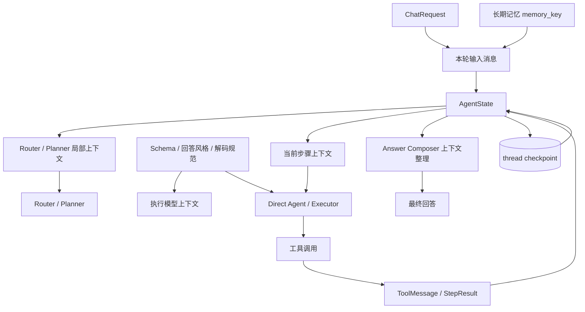

# ChainCloud AI 上下文工程实现说明

> 本文基于当前仓库代码说明 ChainCloud AI 如何采集、组织、注入、持久化和压缩上下文。本文特别区分“已经实现的局部上下文压缩”和“尚未实现的端到端自动压缩”，避免把长期记忆总结等同于完整的上下文窗口治理。

## 1. 结论概览

当前项目已经形成分层的上下文工程，而不是简单地把一段固定 Prompt 和全部聊天记录直接交给模型。系统中的上下文主要分为：

1. 静态业务上下文：数据库 Schema、回答风格、合约解码规范；
2. 会话上下文：同一 `thread_id` 下的历史消息；
3. Agent 执行上下文：计划、当前步骤、依赖结果、权限状态、澄清信息、重试状态；
4. 长期记忆上下文：由线程历史总结后，以 `memory_key` 显式注入；
5. 工具与证据上下文：数据库、RPC、Web 等工具返回的数据及其证据等级；
6. 最终回答上下文：经过裁剪的用户问题、工具结果、执行摘要和回答草稿。

项目已经实现以下压缩手段：

- Router 和 Planner 只读取最近 8 条非工具消息，并实施单条及总字符限制；
- 长期记忆总结最多读取最近 50 条消息、默认最多 12,000 字符；
- Answer Composer 对问题、单个工具结果和草稿分别裁剪；
- Planned 模式按步骤传递依赖结果，减少无关步骤信息；
- 工具调用、步骤重试、重新规划和回答审查均设置次数上限。

但是，当前还没有实现完整的自动上下文压缩：

- 不会根据模型 token 窗口自动触发线程摘要；
- 不会用摘要替换 checkpoint 中的旧消息；
- Direct Agent 和 Executor 仍可能接收不断增长的完整消息列表；
- 没有统一的 token 预算器；
- 没有针对静态 Schema 的动态检索；
- 长期记忆需要显式总结和显式选择，不会自动召回。

因此，当前实现应定义为：**具备分层上下文组织和局部压缩，但尚未具备端到端、token-aware 的自动上下文压缩。**

## 2. 总体结构

一次聊天请求中的主要上下文流如下：



这里有两个相互独立的持久化概念：

| 类型 | 标识 | 内容 | 默认存储 | 作用 |
| --- | --- | --- | --- | --- |
| 会话 checkpoint | `thread_id` | 消息与完整 Agent 执行状态 | 进程内存，可切换 PostgreSQL | 恢复对话和中断的执行流程 |
| 长期记忆 | `memory_key` | 对话摘要及元数据 | 进程内存，可切换 PostgreSQL | 跨线程复用稳定背景信息 |

## 3. 聊天入口如何建立本轮上下文

聊天接口接收以下核心字段：

```json
{
  "thread_id": "thread-001",
  "message": "分析近期链上风险",
  "planning": "auto",
  "memory_key": "project-memory",
  "debug": false
}
```

入口实现在 `src/chaincloud_agent_service/api/routes/chat.py`。

### 3.1 本轮消息组装

每次请求至少生成一条 `HumanMessage`。如果传入 `memory_key`，系统会：

1. 从 MemoryStore 获取记忆；
2. 校验该记忆是否属于当前登录用户；
3. 将摘要包装成 `SystemMessage`；
4. 把该消息放在本轮 `HumanMessage` 之前。

形成的输入类似：

```text
SystemMessage: 以下是该用户或该任务此前沉淀的长期记忆摘要……
HumanMessage: 分析近期链上风险
```

如果 `memory_key` 不存在或不属于当前用户，接口返回 404，避免泄露其他用户是否拥有某条记忆。

### 3.2 checkpoint 合并

调用 LangGraph 时，`thread_id` 被放入：

```python
{"configurable": {"thread_id": body.thread_id}}
```

LangGraph checkpointer 会读取该线程此前保存的 `AgentState`，再通过 `add_messages` reducer 把本轮消息追加到已有消息中。因此，同一个 `thread_id` 能延续历史对话，也能恢复等待审批或等待补充信息的执行任务。

## 4. AgentState：不仅保存聊天记录

`src/chaincloud_agent_service/agent/state.py` 中的 `AgentState` 是上下文的中心载体。它包含以下几组状态。

### 4.1 消息状态

- `messages`：用户、模型、系统和工具消息；
- 使用 LangGraph 的 `add_messages` 进行累积。

### 4.2 路由与规划状态

- `requested_mode`：API 请求的 `auto/direct/planned`；
- `execution_mode`：实际选择的执行模式；
- `route_reason`、`route_confidence`、`route_signals`；
- `plan`、`current_step_id`、`step_results`。

### 4.3 人机协作状态

- `pending_permission`：待审批操作；
- `approved_permission_keys`：已批准的步骤与工具组合；
- `clarified_state`：用户结构化补充的信息；
- `state_validation`：执行前状态检查结果。

### 4.4 质量控制和预算状态

- 工具调用次数；
- 当前步骤重试次数；
- 重新规划次数；
- Evaluator 的动作与反馈；
- Reviewer 的动作、反馈和审查次数；
- 工具错误和失败原因。

### 4.5 可观测性状态

- `trace_id`、`trace_thread_id`；
- 节点、工具、决策和错误事件；
- 请求执行摘要。

这种设计让 checkpoint 保存的是“Agent 工作现场”。恢复任务时，不需要只依靠自然语言历史重新推断当前进度。

## 5. 静态业务上下文

`src/chaincloud_agent_service/agent/schema_context.py` 会从仓库读取：

- `config/agent_database_schema.md`；
- `config/agent_response_style.md`；
- `config/agent_contract_decode.md`。

文件路径由 Settings 控制。存在的内容使用 `---` 分隔并拼成一条基础 System Prompt。

该基础 Prompt 在图编译时读取一次，随后供 Direct Agent 和 Planned Executor 使用。优势是：

- 业务知识和 Python 编排代码解耦；
- 修改表结构说明或回答规范不需要改图逻辑；
- 所有执行路径遵守一致的数据口径。

当前限制是这些文档按文件整体加载，没有按用户问题检索相关段落。随着 Schema 增长，静态 Prompt 会持续变大。

## 6. Router 和 Planner 的上下文

系统不会把全部消息直接交给 Router 和 Planner，而是通过 `_planning_context()` 建立局部窗口：

1. 排除当前最新消息，因为当前问题会单独传递；
2. 从历史中取最近 8 条消息；
3. 排除 `ToolMessage`；
4. 每条消息最多保留 1,000 字符；
5. 拼接结果最多保留末尾 6,000 字符。

Router 获得：

- 当前用户请求；
- 近期对话背景；
- 可用工具名称；
- API 显式指定的执行模式。

Planner 获得：

- 当前目标；
- 同样的近期对话背景；
- 工具名称及每个工具最多 300 字符的描述；
- 上一次无效计划的校验反馈（如果发生重试）。

Planner 最多生成 6 个步骤，并输出结构化 JSON。计划包含步骤目标、成功标准、依赖、建议工具、确认要求、关键性和 fallback 工具。

这一层的目标不是保留完整历史，而是为指代消解和规划提供一个较小且干净的窗口。排除 ToolMessage 可以避免大段查询结果影响路由判断。

## 7. Direct 模式的上下文

Direct 模式适合普通问答或少量工具调用。执行模型收到：

1. 静态业务 System Prompt；
2. Direct 模式指令；
3. 当前线程中的消息列表；
4. 如果本轮携带长期记忆，则包含长期记忆 SystemMessage；
5. 本轮剩余工具调用额度。

如果消息列表第一项是 `SystemMessage`，代码会将静态业务 Prompt、Direct 指令和该 SystemMessage 的内容合并；否则会在消息列表头部新增 SystemMessage。

Direct 模式单轮最多允许 4 次工具调用。工具结果以 `ToolMessage` 追加后，模型再次执行，直到生成不包含 tool call 的回答或达到预算。

需要特别注意：Direct Agent 没有统一裁剪历史 `messages`。同一个线程持续使用时，它可能收到越来越长的消息历史。

## 8. Planned 模式的上下文

复杂请求会进入结构化计划执行。与直接让模型面对整个任务相比，项目将执行上下文收敛到当前步骤。

### 8.1 当前步骤 Prompt

`_step_execution_prompt()` 为 Executor 构造：

- 计划总目标；
- 当前步骤 ID、目标和成功标准；
- 建议工具；
- 当前步骤是否关键；
- 允许使用的 fallback 工具；
- 当前步骤依赖的历史步骤结果；
- 用户补充的执行状态；
- 当前步骤剩余工具调用额度。

只有当前步骤声明的依赖结果会被显式放入步骤 Prompt，而不是把所有步骤结果无差别重复进去。

### 8.2 错误和反馈上下文

如果步骤重试，Executor 还会收到：

- Evaluator 对上一次结果的反馈；
- 最近工具错误的结构化信息；
- 关于参数修复、fallback 和禁止绕过权限的约束。

这样能够把失败信息转化为下一次执行的精确上下文，而不只依赖模型从聊天历史中自行寻找错误。

### 8.3 状态校验

Executor 之前的 State Validation 使用：

- 当前步骤定义；
- 对话文本；
- 依赖步骤结果；
- 用户补充字段；
- 当前可用工具集合。

缺少用户可提供的字段时，状态进入 `blocked_missing_state` 并等待结构化补充；工具或系统能力不可用时则转为 partial 或 fail。

### 8.4 上下文预算边界

当前限制包括：

- 每个 Planned 步骤最多 4 次工具调用；
- 全任务工具调用总数由 `max_total_tool_calls` 控制；
- 步骤重试由 `max_step_retries` 控制；
- 最多重新规划 1 次。

这些限制主要控制执行成本和消息增长速度，并不等同于 token 级上下文压缩。

## 9. 工具结果和证据上下文

工具执行结果以 `ToolMessage` 写入消息状态。Planned 模式完成步骤时，会进一步整理为 `StepResult`：

```text
step_id
status
summary
evidence
tool_calls
error
```

其中：

- `evidence` 保存工具消息的文本预览；
- `tool_calls` 保存使用过的工具名称；
- 工具错误会解析成结构化错误；
- fallback 成功后可以清除原工具的未解决错误；
- 关键步骤和非关键步骤采用不同的失败降级逻辑。

最终回答阶段还会按工具名称推断证据等级：

- Ethereum、TRON、RPC 等：链上 RPC 确认；
- PostgreSQL、ClickHouse、SQL 等：公司数据库确认；
- Web Search：公开资料支持；
- 无法识别的工具：待验证。

这使最终模型不仅看到内容，还能知道内容来自什么类型的证据。

## 10. 最终回答上下文

在 `compose_answer` 节点中，系统先把 AgentState 转换为结构化执行摘要，内容包括：

- 执行模式和路由原因；
- 计划；
- 步骤结果；
- 最终状态；
- 失败原因。

然后 `Answer Composer` 通过 `build_answer_context()` 从消息中重新组织最终回答上下文。

它只构造以下几个区域：

```text
用户问题
工具结果与证据等级
原始回答草稿
```

当前裁剪规则为：

| 内容 | 限制 |
| --- | --- |
| 每条用户问题 | 最多 1,200 字符 |
| 每条工具结果 | 最多 1,600 字符 |
| 每条模型草稿 | 最多 3,000 字符 |
| 最终选择的问题 | 最新一条 |
| 最终选择的草稿 | 最新一条 |

工具消息和草稿虽然逐条裁剪，但工具消息的总数量目前没有总字符上限。因此，长线程存在“单条受控、总量仍增长”的风险。

Planned 任务默认需要 Reviewer 审查；复杂 Direct 任务也可能进入审查。Reviewer 会获得：

- 最新用户问题；
- 当前答案；
- 结构化执行摘要。

最多审查 2 次，避免回答修订无限循环。

## 11. 长期记忆

长期记忆由以下模块实现：

- `memory/models.py`：记忆记录模型；
- `memory/service.py`：摘要和注入逻辑；
- `memory/store.py`：内存及 PostgreSQL 存储；
- `memory/factory.py`：根据配置选择存储；
- `api/routes/memory.py`：保存、读取、列表、删除和总结接口。

### 11.1 记忆内容

每条 `MemoryRecord` 包含：

- `memory_key`；
- `summary`；
- `source_thread_id`；
- `metadata`；
- `updated_at`。

用户元数据会写入记忆，用于所有权隔离。

### 11.2 对话总结

调用 `POST /memory/summarize` 后，服务会：

1. 根据 `thread_id` 读取 checkpoint 中的消息；
2. 只取最近 `max_messages` 条，默认 50 条；
3. 按 `role: content` 转成 transcript；
4. 把 transcript 截断到 `max_chars`，默认 12,000 字符；
5. 请求独立的 Memory LLM 生成摘要；
6. 保存到对应的 `memory_key`。

摘要 Prompt 明确要求只保留：

- 用户偏好；
- 项目背景；
- 重要决策；
- 待办事项；
- 关键约束。

同时要求不逐轮复述、不编造信息。

### 11.3 记忆存储

通过 `MEMORY_STORE_BACKEND` 可以选择：

- `memory`：进程内存，服务重启后丢失；
- `postgres`：使用 `MEMORY_DATABASE_URL` 持久化。

长期记忆数据库与 LangGraph checkpoint 数据库在概念和配置上是独立的。

### 11.4 当前召回方式

长期记忆不会自动召回。调用方必须在聊天请求中明确传入一个 `memory_key`。因此当前没有：

- 向量或全文检索；
- 多条记忆排序；
- 自动选择与当前问题相关的记忆；
- 记忆冲突检测；
- 记忆过期机制；
- 每 N 轮自动总结。

## 12. checkpoint 与执行恢复

`src/chaincloud_agent_service/persistence/checkpoint.py` 提供两种 checkpointer：

- `MemorySaver`：进程内保存；
- `AsyncPostgresSaver`：PostgreSQL 持久化，可跨重启恢复。

checkpoint 使用自定义 serializer，并在部分对象无法使用 msgpack 序列化时回退到 pickle。

保存完整 AgentState 后，系统可以恢复：

### 12.1 权限审批

高风险或有副作用的步骤进入 `waiting_confirmation`。checkpoint 保存：

- 当前计划和步骤；
- 待审批工具；
- 风险等级和原因。

批准后从 `select_step` 继续，不需要重新规划整个任务。

### 12.2 信息澄清

缺少必要字段时进入 `blocked_missing_state`。用户通过结构化接口提交字段后，数据写入 `clarified_state`，随后重新运行 State Validation。

这种可恢复状态本身也是上下文工程的一部分：重要执行信息被保存为明确字段，而不是埋在自然语言对话中。

## 13. 当前已经实现的上下文压缩

### 13.1 固定窗口截取

Router 和 Planner 使用最近 8 条非工具历史，避免读取完整线程。

### 13.2 字符级裁剪

- Planning 上下文：每条最多 1,000 字符，总计最多 6,000 字符；
- Memory transcript：默认最多 12,000 字符；
- Answer Composer 用户问题：每条最多 1,200 字符；
- Answer Composer 工具结果：每条最多 1,600 字符；
- Answer Composer 草稿：每条最多 3,000 字符；
- Planner 工具描述：每个最多 300 字符；
- StepResult 证据预览：每条工具消息最多保留 2,000 字符。

### 13.3 LLM 摘要压缩

`/memory/summarize` 把一段线程历史压缩成可复用的长期记忆摘要。但这是显式调用的长期记忆功能，不会替换原 checkpoint 中的历史消息。

### 13.4 结构化压缩

项目还通过结构化状态减少模型重复理解原始历史：

- 将任务压缩成 Plan；
- 将工具执行压缩成 StepResult；
- 将全局执行状态压缩成 execution summary；
- 将错误解析成结构化错误；
- 将用户补充信息写入 `clarified_state`。

这类压缩未必删除消息，但能让后续节点直接消费高密度信息。

### 13.5 执行预算

工具、重试、重新规划和审查次数上限限制了单次任务产生上下文的速度。这是间接的上下文增长控制。

## 14. 尚未实现的完整压缩能力

### 14.1 没有自动触发阈值

系统没有计算当前消息的真实 token 数，也没有在达到模型窗口的某个比例后自动压缩。

### 14.2 没有滚动会话摘要

旧消息不会被总结成一条线程摘要，也不会从活跃消息列表中移除或替换。

### 14.3 核心执行路径仍使用完整 messages

Direct Agent 和 Planned Executor 会复制 `state["messages"]` 并交给模型。虽然额外步骤 Prompt 是局部的，但基础消息历史仍可能不断增长。

### 14.4 长期记忆不等于线程压缩

长期记忆摘要保存在独立 MemoryStore 中，只有显式传入 `memory_key` 才会注入；原线程中的历史仍保留在 checkpoint。因此它解决的是跨线程背景复用，而不是自动缩小当前线程。

### 14.5 没有静态知识检索

Schema、回答风格和解码规范按文件全量注入，没有根据请求只取相关表、字段或规则。

### 14.6 没有统一总预算

当前各模块分别使用字符上限，没有统一的 Context Budget，也没有明确保证：

```text
system + memory + history + step + tools + output reserve <= model context window
```

### 14.7 存在重复长期记忆的可能

如果同一线程多次携带 `memory_key`，每次都会新增一个 SystemMessage。当前没有稳定的 memory message ID、去重或替换机制。

## 15. 当前上下文策略的优点

1. 分层清楚：静态知识、线程状态和长期记忆没有混成一个存储；
2. 可恢复：checkpoint 保存计划执行现场，而不仅是对话文本；
3. 节点专用上下文：Router、Planner、Executor、Composer 各自获得不同的信息；
4. 证据意识较强：工具来源在最终回答前被分级；
5. 人机协作状态结构化：审批和澄清可以准确恢复；
6. 有局部压缩：多个关键位置已经设置窗口和字符上限；
7. 有增长边界：调用、重试、重规划和审查均有上限；
8. 存储可替换：checkpoint 和长期记忆都支持内存与 PostgreSQL 后端。

## 16. 当前风险

### 16.1 长线程 token 持续增长

同一个 `thread_id` 长期使用时，Direct Agent 和 Executor 可能接收越来越多的历史消息和工具结果，最终造成：

- 请求成本增加；
- 响应延迟上升；
- 重要信息被长历史稀释；
- 超出模型上下文窗口。

### 16.2 字符限制不等于 token 限制

中文、英文、代码和 JSON 的 token 密度不同。字符裁剪只能提供粗略保护，无法精确预留模型输出空间。

### 16.3 工具证据总量没有上限

Answer Composer 对每条工具结果进行裁剪，但没有限制工具结果的总条数或总 token 数。

### 16.4 压缩内容可能丢失关键约束

Planning 使用固定的最近 8 条窗口。如果关键约束只存在于更早的消息中，并且未被长期记忆保存，Router 和 Planner 可能看不到它。

### 16.5 长期记忆依赖人工管理

用户或调用方需要知道何时总结、使用哪个 `memory_key`，系统不会自动判断相关性。

## 17. 推荐升级方案

建议按照以下顺序演进。

### 第一阶段：统一 ContextBuilder

所有模型调用都通过统一上下文构建器，并按优先级分配 token：

```text
1. 安全和系统规则
2. 当前用户请求
3. 当前计划与步骤
4. 必需的依赖证据
5. 相关长期记忆
6. 最近对话
7. 较早历史摘要
8. 为模型输出预留 token
```

ContextBuilder 应记录每一类内容的 token 使用量和被裁剪原因，方便 debug 和评估。

### 第二阶段：线程滚动摘要

当消息超过 token 或消息数阈值时：

1. 保留最近若干轮原始消息；
2. 将更早消息总结为 `conversation_summary`；
3. 保存摘要覆盖的消息范围或 message ID；
4. 执行模型只读取摘要、最近窗口和当前任务状态；
5. checkpoint 可保留归档消息，但不再全部放入活跃模型上下文。

### 第三阶段：工具结果分层保存

工具结果建议拆成：

- 完整原始结果：存储在外部结果表或对象存储；
- 结构化事实：保存在 AgentState；
- 给模型的短摘要：放入活跃消息；
- 引用信息：保存工具名、查询条件、时间和结果 ID。

这样既能追溯完整证据，又不需要持续把大 JSON 放入模型上下文。

### 第四阶段：动态静态知识检索

将大型数据库 Schema 按数据源、表和业务主题切分，根据请求和计划步骤选择相关片段。回答风格等短小且全局有效的规则仍可固定注入。

### 第五阶段：长期记忆自动召回

为记忆增加：

- `user_id`、`project_id`、`entity_id`、`task_type` 等作用域；
- 重要性、置信度、来源和过期时间；
- 关键词或向量索引；
- 多条记忆的相关性排序；
- 冲突和新旧版本处理。

自动召回仍应设置数量和 token 上限，并在调试 trace 中说明为什么选择某条记忆。

### 第六阶段：压缩质量评估

建议增加测试集，检查压缩后是否保留：

- 用户核心目标；
- 数字、地址、交易哈希和时间；
- 已确认的决策；
- 尚未完成的任务；
- 权限边界和用户明确约束；
- 工具证据来源；
- 不确定性和失败信息。

同时测试压缩前后回答质量、token 数、延迟和费用。

## 18. 关键代码索引

| 功能 | 文件 |
| --- | --- |
| 聊天输入和长期记忆注入 | `src/chaincloud_agent_service/api/routes/chat.py` |
| Agent 状态结构 | `src/chaincloud_agent_service/agent/state.py` |
| 上下文编排和 LangGraph 流程 | `src/chaincloud_agent_service/agent/graph.py` |
| 静态 Schema/风格/解码规则加载 | `src/chaincloud_agent_service/agent/schema_context.py` |
| Router 上下文 | `src/chaincloud_agent_service/agent/routing/router.py` |
| Planner 上下文 | `src/chaincloud_agent_service/agent/planning/planner.py` |
| 最终回答上下文整理 | `src/chaincloud_agent_service/agent/answer_composer/renderer.py` |
| 最终回答 Prompt | `src/chaincloud_agent_service/agent/answer_composer/prompts.py` |
| 长期记忆服务和总结 | `src/chaincloud_agent_service/memory/service.py` |
| 长期记忆存储 | `src/chaincloud_agent_service/memory/store.py` |
| 长期记忆存储选择 | `src/chaincloud_agent_service/memory/factory.py` |
| 长期记忆 API | `src/chaincloud_agent_service/api/routes/memory.py` |
| checkpoint 后端 | `src/chaincloud_agent_service/persistence/checkpoint.py` |

## 19. 最终判断

当前项目已经具备较完整的上下文工程骨架：它能把上下文拆分为消息、状态、长期记忆、步骤依赖和工具证据，并在不同节点使用不同上下文视图。尤其是基于 checkpoint 的任务恢复、Planned 模式的步骤上下文，以及最终回答阶段的证据整理，已经超出了普通聊天机器人的 Prompt 拼接方式。

但从上下文压缩角度看，当前实现仍属于第一阶段：已经有固定窗口、字符裁剪、显式摘要和结构化提炼，却还没有自动 token 预算、滚动摘要和旧消息替换。短期和中等长度任务有较好的控制；长生命周期线程仍需要进一步治理。
