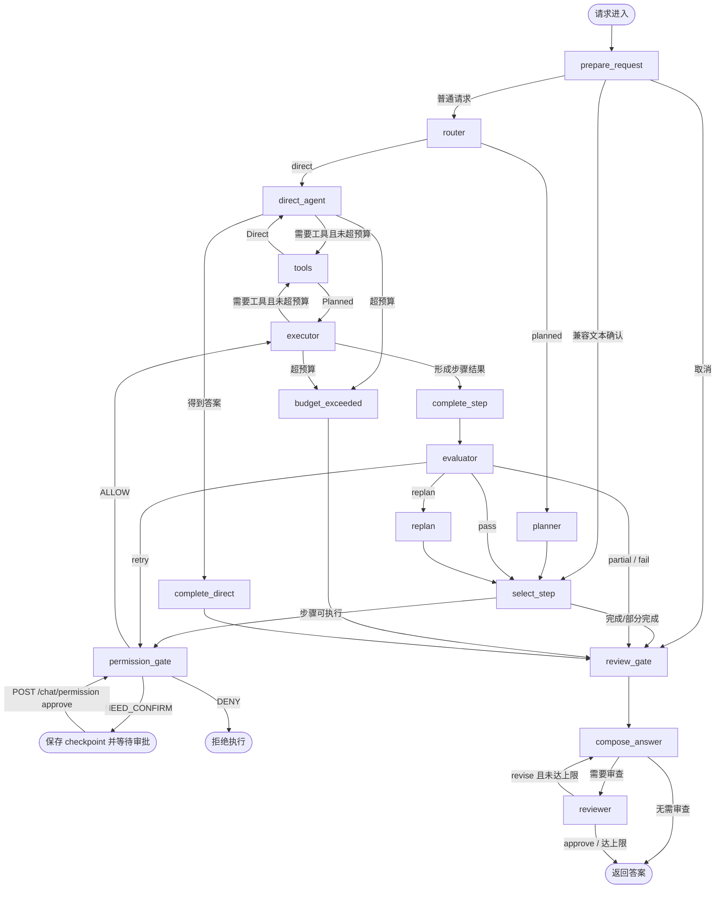
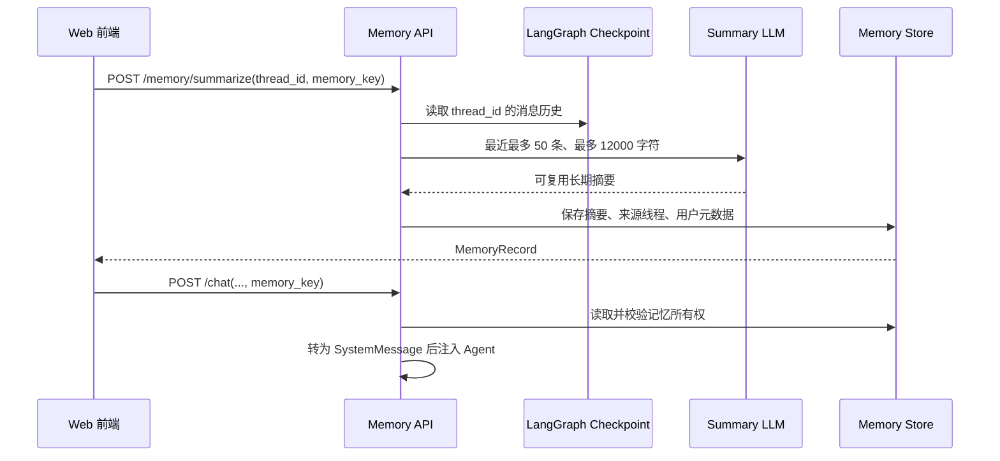

# ChainCloud AI 项目架构与运行流程

> 本文基于当前仓库代码整理，描述系统已经实现的结构、运行链路和扩展方式。文档中的“当前”指本文生成时的代码状态。

## 1. 项目定位

ChainCloud AI 是一个面向链上数据分析与企业知识问答的全栈智能体应用。它以 FastAPI 暴露 HTTP API，以 LangGraph 编排大模型、工具调用、任务规划、结果评估和回答审查，并提供 React Web 客户端。

当前系统不仅支持普通对话，还包括：

- 自动选择“直接执行”或“规划执行”；
- PostgreSQL、ClickHouse、知识库、Web 搜索和链节点查询；
- 图表、仪表盘和清算模拟结果生成；
- 按 `thread_id` 保存的短期会话状态；
- 可单独保存、总结和注入的长期记忆；
- 用户注册、登录和 Bearer Token 鉴权；
- APScheduler 定时任务；
- 普通 JSON 响应与 NDJSON 流式响应；
- 可选执行 trace，便于调试和展示 Agent 的阶段进度。

## 2. 技术栈

| 层级 | 技术 | 主要用途 |
| --- | --- | --- |
| Web 前端 | React、TypeScript、Vite | 登录、对话、流式进度、记忆管理、工具展示、图表展示 |
| HTTP 后端 | FastAPI、Uvicorn、Pydantic | API、参数校验、应用生命周期、静态图表托管 |
| Agent 编排 | LangGraph、LangChain Core | 状态图、工具循环、消息状态、checkpoint |
| 模型接入 | `langchain-openai` | OpenAI 或兼容 OpenAI 协议的模型服务 |
| 持久化 | PostgreSQL / 进程内存 | checkpoint、长期记忆、用户数据 |
| 数据工具 | psycopg、clickhouse-connect、HTTP RPC | PostgreSQL、ClickHouse、TRON、Ethereum 查询 |
| 可视化 | pandas、Plotly | 图表、仪表盘、清算模拟 |
| 调度 | APScheduler | 单次或 Cron 定时执行 Agent 任务 |
| 测试 | pytest 测试集 | 路由、规划、记忆、认证、工具、质量控制等 |

Python 要求为 3.11～3.13；前端要求 Node.js 20.19+、npm 10+。

## 3. 总体架构

```mermaid
flowchart LR
    U[浏览器用户] --> FE[React / Vite 前端]
    FE -->|Bearer Token + HTTP| API[FastAPI API 层]
    API --> AUTH[认证服务]
    API --> MEM[长期记忆服务]
    API --> GRAPH[LangGraph Agent]

    GRAPH --> LLM[OpenAI 兼容模型]
    GRAPH --> REG[工具注册表]
    GRAPH <--> CP[会话 Checkpoint]

    REG --> PG[(只读 PostgreSQL)]
    REG --> CH[(ClickHouse 数据源)]
    REG --> RPC[TRON / Ethereum RPC]
    REG --> WEB[Web Search]
    REG --> VIS[图表 / 仪表盘]
    REG --> SCH[APScheduler]

    AUTH --> USTORE[(用户存储)]
    MEM --> MSTORE[(长期记忆存储)]
    VIS --> FILES[/charts/*.html]
    API --> FILES
```

这里存在三类相互独立的数据状态，不能混为一谈：

| 状态 | 标识 | 默认存储 | 用途 |
| --- | --- | --- | --- |
| LangGraph 会话 checkpoint | `thread_id` | 内存；配置 `DATABASE_URL` 后为 PostgreSQL | 保存消息和 Agent 执行状态，可恢复同一会话或等待确认的计划 |
| 长期记忆 | `memory_key` | 内存；可配置独立 PostgreSQL | 保存由对话总结出的长期背景，后续按需注入新请求 |
| 用户账号 | `user_id` / `username` | 内存；可配置独立 PostgreSQL | 注册、登录、身份识别和记忆所有权隔离 |

## 4. 目录与模块职责

```text
Chaincloud-AI-main/
├── src/chaincloud_agent_service/
│   ├── main.py                  # FastAPI 创建、生命周期和路由挂载
│   ├── config.py                # .env 与环境变量配置
│   ├── api/
│   │   ├── auth.py              # API 侧鉴权辅助逻辑
│   │   └── routes/              # chat、auth、memory、scheduler、tools
│   ├── agent/
│   │   ├── graph.py             # Agent 状态图唯一总编排入口
│   │   ├── state.py             # checkpointed AgentState
│   │   ├── schema_context.py    # 业务提示文档加载与系统提示拼装
│   │   ├── routing/             # direct/planned 路由
│   │   ├── planning/            # 计划生成、模型与校验
│   │   ├── evaluation/          # 单步骤结果评估
│   │   ├── review/              # 最终答案审查
│   │   └── answer_composer/     # 证据整理、复杂度判断、最终答案渲染
│   ├── tools/                   # 所有仓库内置 LangChain 工具
│   ├── persistence/             # LangGraph checkpoint
│   ├── memory/                  # 长期记忆模型、服务、存储和工厂
│   ├── auth/                    # 密码、Token、用户服务和存储
│   └── observability/           # Agent trace 提取
├── frontend/chaincloud-agent-web/
│   └── src/                     # React 页面、API 客户端、类型和样式
├── config/                      # 数据库语义、回答风格、解码流程、CH 数据源
├── docs/sql/                    # checkpoint 之外的业务表初始化 SQL
├── scripts/                     # 环境检查、数据库初始化、启动与工具测试
├── tests/                       # 后端自动化测试
├── docker-compose.yml           # 本地 PostgreSQL 16
└── pyproject.toml               # Python 包与依赖定义
```

## 5. 后端启动流程

应用入口是 `chaincloud_agent_service.main:app`。FastAPI 的 `lifespan` 按以下顺序初始化：

1. `load_settings()` 搜索项目路径上的 `.env` 并读取环境变量；操作系统已有变量优先。
2. 校验 `OPENAI_API_KEY`，缺失时直接阻止服务启动。
3. 根据 `MEMORY_STORE_BACKEND` 创建内存或 PostgreSQL 长期记忆存储，并构造 `MemoryService`。
4. 创建单独的 `ChatOpenAI`，用于把 checkpoint 中的对话总结为长期记忆。
5. 根据认证配置创建用户存储和 `AuthService`。
6. 根据 `DATABASE_URL` 选择 LangGraph checkpoint：
   - 未配置：`MemorySaver`，仅当前进程有效；
   - 已配置：`AsyncPostgresSaver`，启动时执行 `setup()`，支持跨重启恢复。
7. `compile_agent_graph()` 加载工具、系统提示、模型并编译状态图。
8. 将配置、图、记忆服务和认证服务放入 `app.state`，供路由复用。
9. 启动 APScheduler，并注册定时任务执行器。每个任务使用 `scheduled:<task_id>` 作为会话 ID。
10. 挂载 `/charts` 静态目录以及认证、聊天、记忆、调度和工具路由。

## 6. 一次聊天请求的完整流程

### 6.1 HTTP 入口

`POST /chat` 与 `POST /chat/stream` 接收相同的核心字段：

```json
{
  "thread_id": "user-thread-001",
  "message": "分析某协议近期的清算风险并生成图表",
  "planning": "auto",
  "memory_key": "user-project-memory",
  "debug": false
}
```

处理步骤如下：

1. 验证动态登录 Token，或在配置了 `CHAT_API_TOKEN` 时验证静态 Token。
2. 若提供 `memory_key`，读取长期记忆并校验它属于当前用户，然后作为 `SystemMessage` 注入。
3. 将本轮输入包装为 `HumanMessage`。
4. 使用 `thread_id` 调用 `graph.ainvoke()` 或 `graph.astream()`；LangGraph 自动读取并更新该线程 checkpoint。
5. 后端移除模型可能返回的 `<think>` 内容，提取图表 URL。
6. 普通接口返回最终 JSON；流式接口返回一行一个 JSON 对象的 NDJSON 事件。

### 6.2 Agent 总流程



### 6.3 Permission Gate 与确认恢复

`permission_gate` 位于 `select_step` 和 `executor` 之间，不调用 LLM，而是根据
`agent/permission.py` 中的确定性规则返回：

- `ALLOW`：只读工具直接执行；
- `NEED_CONFIRM`：副作用或高风险工具写入 `pending_permission`，状态进入
  `waiting_confirmation`，checkpoint 保存后停止；
- `DENY`：明显越权、窃取凭据等操作进入 `permission_denied`，不执行工具。

流式接口在等待时发送 `permission_required`，包含 `step_id`、`tool_name`、
`risk_level`、`reason`、`operation_summary` 和 `estimated_impact`。前端通过
`POST /chat/permission` 提交 `approve` 或 `cancel`。批准键采用
`step_id:tool_name`，重新规划时会清空，不能授权后续步骤或其他工具。

`prepare_request` 会检查当前 checkpoint 是否处于 `waiting_confirmation`：

- 用户输入“确认、继续、yes、proceed”等固定确认词时，批准当前步骤并从 `select_step` 恢复；
- 用户输入“取消、停止、no、cancel”等固定取消词时，终止计划并生成取消结果；
- 其他情况作为新请求进入 Router。

上述文本确认/取消逻辑继续保留为兼容兜底；正常前端审批不再伪装成聊天消息。

### 6.4 Direct 路径

Direct 适合无需工具或单一工具即可完成、无跨源依赖、无副作用的请求。执行器可循环调用工具，但不会向用户展示计划。得到文本后进入统一回答合成阶段。

Direct 并非一定跳过 Reviewer。高风险主题、复杂信号或多工具调用仍会触发最终审查。

### 6.5 Planned 路径

Planned 适合多步骤、多数据源、存在依赖、需要证据链/报告/图表/比较/风险评估，或可能修改外部状态的任务：

1. Planner 生成包含目标、步骤、依赖、推荐工具、成功标准和确认要求的结构化 `Plan`。
2. Validator 检查步骤 ID、依赖关系和工具引用；无效输出会重试，之后降级到安全单步骤计划。
3. `select_step` 只选择依赖均成功的未完成步骤。
4. `permission_gate` 用代码规则审核当前步骤；需要确认时保存 checkpoint 并暂停。
5. Executor 只执行已允许的当前步骤，并获得已完成依赖步骤的结果。
6. `complete_step` 收集文本结果、工具名及工具证据，形成 `StepResult`。
7. Evaluator 根据成功标准返回 `pass`、`retry`、`replan`、`partial` 或 `fail`。
8. 所有可执行步骤完成后，Answer Composer 根据结构化摘要生成面向用户的最终回答。
9. Planned 回答默认进入 Reviewer，检查证据一致性和事实边界；需要时重新合成。

### 6.6 安全预算与终止条件

图中设置了硬限制，避免工具或模型循环失控：

| 限制 | 当前值 |
| --- | ---: |
| 整个 Planned 任务工具调用数 | 12 |
| 单步骤工具调用数 | 4 |
| Direct 工具调用数 | 4 |
| 单步骤重试次数 | 2 |
| 重新规划次数 | 1 |
| 回答审查次数 | 2 |

超出工具预算时，待执行调用不会继续运行，状态转为 `partial`，最终回答会说明限制。

## 7. 路由策略

当 `planning=auto` 时使用三层判断：

1. API 显式指定 `direct` 或 `planned` 时直接采用，置信度为 1；
2. 自动模式先执行确定性规则；
3. 规则无法决定时由模型输出结构化路由判断。

模型置信度低于 0.6、JSON 解析失败或模型调用异常时，系统保守降级到 Planned。路由结果会写入 `AgentState`，包括模式、原因、置信度、来源和命中信号。

## 8. Agent 状态与 checkpoint

`AgentState` 的 `messages` 使用 LangGraph 的 `add_messages` 合并器，其余关键状态包括：

- 路由：`requested_mode`、`execution_mode`、`route_reason`、`route_signals`；
- 计划：`plan`、`current_step_id`、`approved_step_ids`；
- 执行：`step_results`、`candidate_step_result`、各种工具调用计数；
- 质量控制：`evaluation_action`、`review_action`、反馈与尝试次数；
- 生命周期：`planning`、`executing`、`completed`、`partial`、`failed`、`waiting_confirmation`。

系统提示不会直接写入 checkpoint。每次执行节点调用模型前，才把以下配置文档合并为 SystemMessage：

- `config/agent_database_schema.md`：业务数据库语义；
- `config/agent_response_style.md`：回答风格；
- `config/agent_contract_decode.md`：合约交易解码流程。

若请求注入了长期记忆，该记忆系统消息会与上述系统提示合并使用。

## 9. 工具体系

工具均在仓库内实现为 LangChain `StructuredTool`，由 `tools/registry.py:get_tools()` 按配置动态注册，不依赖 MCP。

| 工具 | 启用条件 | 作用 |
| --- | --- | --- |
| `postgres_select` | `READONLY_DATABASE_URL` | 执行受限只读 PostgreSQL 查询 |
| `postgres_list_tables` | 同上 | 列出数据库表 |
| `postgres_table_schema` | 同上 | 获取表结构 |
| `search_knowledge` | 同上 | 搜索 PostgreSQL 知识库 |
| `web_search` | `WEB_SEARCH_ENABLED=true` | 通过配置的搜索提供方查询 Web |
| 多种 `generate_*_chart` | 始终注册 | 生成柱状图、时序图、饼图、多折线图、双轴图、分布图 |
| `generate_liquidation_simulation_chart` | 配置只读 PG | 查询数据并生成清算模拟图 |
| `create_dashboard` | 始终注册 | 组合生成仪表盘 |
| `add_scheduled_task` | 始终注册 | 创建 date/cron 定时任务 |
| `clickhouse_list_datasources` | 存在 CH 数据源 | 列出可用 ClickHouse 数据源 |
| `clickhouse_select` | 同上 | 对指定数据源执行只读查询 |
| `tron_node_request` | 配置 TRON RPC | 请求 Full/Solidity 节点 HTTP API |
| `ethereum_jsonrpc` | 配置 Ethereum RPC | 调用标准 JSON-RPC 方法 |
| `contract_decode_tx_input` | 配置解码脚本 | 通过 Node.js 脚本解码交易输入 |

图表工具将 HTML 写入 `CHART_DIR`（默认 `charts`），FastAPI 通过 `/charts` 对外提供。`GET /tools` 可查看当前环境实际注册的工具、描述和参数 schema，但不会执行工具或暴露密钥。

## 10. 长期记忆流程

长期记忆和 LangGraph checkpoint 是解耦的：checkpoint 自动保留完整会话状态；长期记忆由用户主动总结并在未来显式选择注入。



记忆接口包括保存、按线程总结、列表、详情和删除。认证用户只能访问元数据属于自己的记忆；对旧数据兼容以用户名开头的 `memory_key`。

## 11. 认证流程

认证模块支持进程内存和 PostgreSQL 两种用户存储：

1. `POST /auth/register` 规范化用户名、哈希密码、创建用户并立即签发 Token；
2. `POST /auth/login` 校验密码、更新最近登录时间并签发 Token；
3. `GET /auth/me` 验证 Bearer Token 并读取用户；
4. 对话允许动态用户 Token，也兼容 `CHAT_API_TOKEN` 静态鉴权；
5. 记忆管理要求已认证用户，并进行所有权隔离。

`AUTH_TOKEN_SECRET` 未配置时会使用仅适合本地开发的默认值，生产环境必须覆盖。

## 12. 定时任务流程

定时任务有两种创建入口：

- HTTP：`POST /schedule`，绕过模型工具调用；
- Agent 工具：`add_scheduled_task`。

任务触发后，Scheduler 调用启动阶段注册的 `_scheduled_executor`，将原始 prompt 送入同一个 LangGraph，并以 `scheduled:<task_id>` 隔离 checkpoint。当前 Scheduler 是进程内运行时组件，服务停止时调度执行也会停止；部署多副本时还需要考虑重复调度与任务持久化问题。

## 13. 前端流程

前端入口位于 `frontend/chaincloud-agent-web/src/App.tsx`：

1. 用户注册或登录，Token 与用户信息保存到浏览器本地存储；
2. 页面生成带用户名和日期的 `thread_id`、`memory_key`；
3. 发送消息时调用 `/chat/stream`；
4. 根据 `route_selected`、`plan_created`、`step_started`、`step_evaluated`、`review_decided` 等事件显示执行进度；
5. `delta` 事件逐字追加最终答案；
6. 前端识别 Markdown 图片、`/charts/*.html` 图表和链上哈希/地址，分别渲染或提供复制；
7. 用户可将当前线程总结为长期记忆，并在后续会话选择使用；
8. 页面通过 `/tools` 展示当前后端可用能力。

开发环境中，Vite 把 `/auth`、`/chat`、`/charts`、`/memory` 和 `/tools` 代理到 `127.0.0.1:8001`。`/schedule` 当前未配置到 Vite 代理，因为现有 Web 页面不直接使用该入口。

## 14. API 一览

| 方法 | 路径 | 说明 |
| --- | --- | --- |
| POST | `/auth/register` | 注册并获取 Token |
| POST | `/auth/login` | 登录并获取 Token |
| GET | `/auth/me` | 获取当前用户 |
| POST | `/chat` | 非流式对话，可选 trace |
| POST | `/chat/stream` | NDJSON 流式对话与进度事件 |
| POST | `/memory` | 手工保存长期记忆 |
| POST | `/memory/summarize` | 从某个 checkpoint 线程总结记忆 |
| GET | `/memory` | 列出当前用户记忆 |
| GET | `/memory/{memory_key}` | 获取记忆详情 |
| DELETE | `/memory/{memory_key}` | 删除记忆 |
| POST | `/schedule` | 创建单次或 Cron 任务 |
| GET | `/tools` | 查看当前注册工具 |
| GET | `/charts/{file}.html` | 访问工具生成的交互图表 |
| GET | `/docs` | FastAPI 自动生成的 Swagger 文档 |

## 15. 关键配置分组

| 分组 | 主要变量 |
| --- | --- |
| 模型 | `OPENAI_API_KEY`、`OPENAI_BASE_URL`、`OPENAI_MODEL`、`OPENAI_TIMEOUT_SEC`、`OPENAI_MAX_RETRIES` |
| checkpoint | `DATABASE_URL` |
| 长期记忆 | `MEMORY_STORE_BACKEND`、`MEMORY_DATABASE_URL`、`MEMORY_POSTGRES_TABLE`、`MEMORY_POSTGRES_AUTO_CREATE` |
| 认证 | `AUTH_DATABASE_URL`、`AUTH_USERS_TABLE`、`AUTH_POSTGRES_AUTO_CREATE`、`AUTH_TOKEN_SECRET`、`AUTH_TOKEN_EXPIRE_MINUTES`、`CHAT_API_TOKEN` |
| PostgreSQL 工具 | `READONLY_DATABASE_URL` |
| ClickHouse | `CLICKHOUSE_DATASOURCES_CONFIG_PATH` 及 `READONLY_CLICKHOUSE_*` |
| 搜索 | `WEB_SEARCH_ENABLED`、`WEB_SEARCH_PROVIDER`、`TAVILY_API_KEY`、结果数与超时配置 |
| 链节点 | `TRON_FULL_RPC`、`TRON_SOLIDITY_RPC`、`ETHEREUM_JSONRPC_URL` |
| 合约解码 | `CONTRACT_DECODE_SCRIPT_PATH`、`CONTRACT_PARSER_CWD`、`CONTRACT_DECODE_TIMEOUT_SEC` |
| Agent 上下文 | `AGENT_DATABASE_SCHEMA_PATH`、`AGENT_RESPONSE_STYLE_PATH`、`AGENT_CONTRACT_DECODE_PATH` |
| 图表 | `CHART_DIR` |

`DATABASE_URL`、`MEMORY_DATABASE_URL` 和 `AUTH_DATABASE_URL` 可以指向同一 PostgreSQL 实例，但职责不同。生产环境建议至少使用不同表和明确权限；业务查询工具必须继续使用只读连接。

## 16. 本地运行

```bash
# 后端依赖
uv sync --extra dev

# 可选：启动本地 PostgreSQL
docker compose up -d postgres

# 启动后端
uv run uvicorn --app-dir src chaincloud_agent_service.main:app \
  --reload --host 0.0.0.0 --port 8001

# 另一个终端启动前端
cd frontend/chaincloud-agent-web
npm install
npm run dev
```

访问地址：

- Web：`http://127.0.0.1:3000`
- API 文档：`http://127.0.0.1:8001/docs`

运行测试：

```bash
uv run pytest
```

前端生产构建：

```bash
cd frontend/chaincloud-agent-web
npm run build
```

## 17. 当前设计特点与扩展点

### 已形成的边界

- API 只负责协议、鉴权和输入输出，核心业务编排集中在 `agent/graph.py`；
- 工具统一从 Registry 注册，可通过环境配置裁剪能力；
- checkpoint、长期记忆、认证各有 Store/Service 边界；
- Planner、Evaluator、Reviewer 和 Answer Composer 分离，便于独立替换提示词或实现；
- 同一套 Agent 同时服务普通请求、流式请求与定时任务。

### 后续扩展时应重点关注

- `agent/graph.py` 已较集中，新增大型流程时可进一步拆出节点模块，避免单文件继续膨胀；
- 当前模型节点多为同步 `invoke`，而 HTTP 图执行是异步的；高并发场景可评估统一异步调用；
- 进程内 Scheduler 不适合直接横向扩容，应增加持久化 job store、分布式锁或独立 Worker；
- 生产环境应持久化 checkpoint、用户和长期记忆，并替换默认 Token Secret；
- 图表静态目录需要容量管理、文件生命周期和访问权限设计；
- 工具层虽已有只读约束，仍应在数据库账号层继续落实最小权限、超时和返回行数限制；
- 前端生产部署需要为 API、`/charts` 等配置反向代理，Vite 的开发代理不会进入生产构建；
- 可继续补充端到端测试，覆盖真实流式事件、确认恢复、Scheduler 和多实例持久化场景。

## 18. 一句话总结

当前项目已经形成“React 交互层 → FastAPI 服务层 → LangGraph 质量控制型 Agent → 动态工具与多数据源 → 三类独立状态存储”的完整骨架；核心调用链以 Router 分流，Planned 路径通过 Planner、Executor、Evaluator、Reviewer 构成闭环，并由 checkpoint、长期记忆和认证体系提供连续会话与用户隔离。
